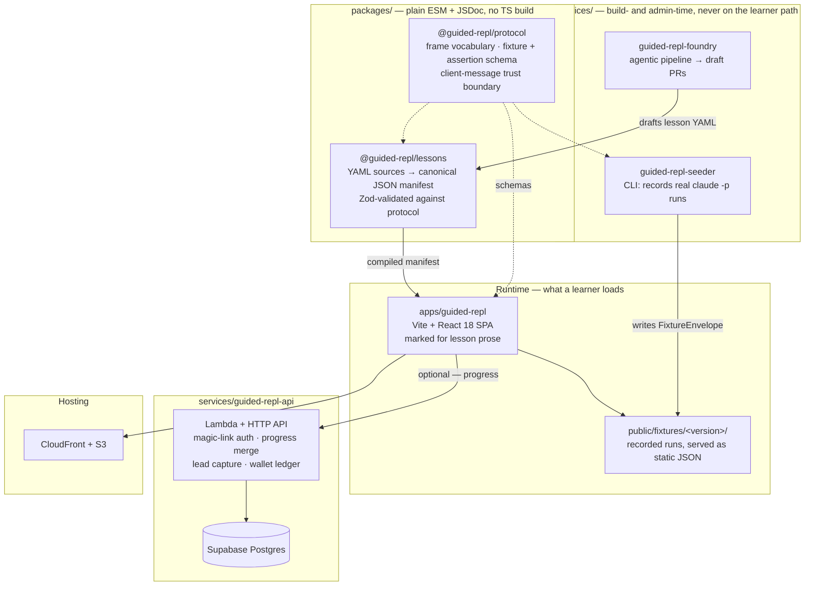
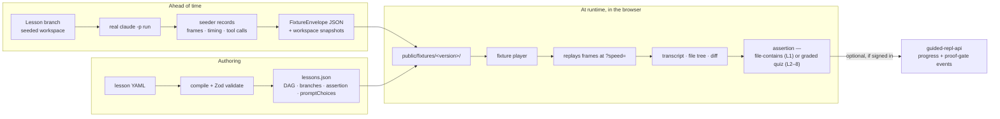
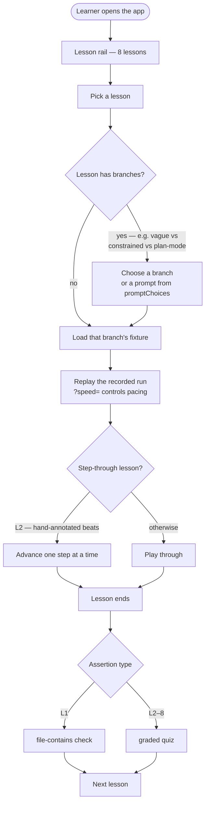

# guided-repl

Vite + React SPA for the Guided REPL — a guided replay of real, recorded
Claude Code sessions. Each lesson replays an actual `claude -p` run (frames,
timing, tool calls) against a seeded workspace, so learners see the real
transcript, file tree, and diff without needing a live agent or API key.

**All 8 lessons are live**, each a recorded, replayable `claude -p` run (or
runs) selectable from the lesson rail:

1. Ship a page in 90 seconds — 3 branches (`vague`, `constrained`, `plan-mode`)
2. Why did it do that? — a step-through replay of L1's `constrained` run,
   hand-annotated at three beats, advanced one step at a time
3. The prompt ladder — restyle the page, vague vs. constrained vs. planned
4. Plan mode & prompt planning — approve a plan as-is, or revise it first
5. Permission modes & the leash — the same edit under plan/acceptEdits/bypass
6. Reading diffs & verifying — a clean branch vs. a planted-bug branch
7. CLAUDE.md — teaching your agent — the same prompt with/without a
   workspace `CLAUDE.md`
8. Cost, models & going live — the same edit on Haiku vs. Sonnet

Lessons 2–8 end in a graded quiz assertion instead of L1's file-contains
check. `lessons.json`'s `assertion` field carries whichever check ends that
lesson.

## Architecture

The defining property: **no live agent and no API key at runtime.** Every lesson
is a recording made ahead of time by the seeder, so the player is a pure
fixture-replay client. That is what makes the app cheap to serve and
deterministic to test.

The system spans six directories — this app, three services, two packages.

### Tech stack



### Data flow

Recording and playback are fully separated in time. Fixtures are pinned by
`VITE_FIXTURE_VERSION`, and re-recording ships under a **new** version
directory rather than overwriting — old fixture sets stay byte-stable, which
matters because they are served with long cache lifetimes.



### App flow



## Quickstart

```
npm install
npm run dev            # local dev server
npm test                # node --test src (unit tests; 62 tests)
npm run build           # production build
npm run preview          # preview the build (:4173)
npm run e2e              # Playwright e2e (builds + previews + runs specs; 17 specs)
npm run check:lessons    # DAG <-> fixtures consistency, then prompt-join check
```

`check:lessons` runs two scripts in sequence: `scripts/checkLessons.js`
(DAG/fixture/snapshot consistency + redaction) and
`scripts/checkPromptJoin.js` (verifies every branch's `expectedPrompt` is
reproducible from its lesson's `promptChoices` via the
`task + " " + subject + (", " + constraint)?` join rule).

## The `?speed=` convention

The fixture player multiplies every recorded frame's `delayMs` by a
`speedMultiplier` read from the `speed` query param (`App.jsx`). `?speed=0`
replays a whole recording synchronously (used by e2e specs and
`scripts/replayHarness.js` for determinism); omit it (or use `1`) for
realistic real-time pacing in normal browsing.

## Fixture layout + version pinning

```
public/fixtures/<version>/
  lessons.json              # lesson DAG: branches, branchConfig, assertion, promptChoices
  fixtures/<lessonId>/<branchId>.json   # one recorded FixtureEnvelope per branch
  snapshots/<snapshotId>.json           # seed/output workspace snapshots
```

`.env` sets `VITE_FIXTURE_VERSION=v1`, which selects the `public/fixtures/`
subdirectory the app and `scripts/checkLessons.js` load. It's committed
intentionally — it pins a public fixture-set path, not a secret. Bumping it
(and publishing a new `public/fixtures/<version>/` directory from the
seeder's output) is how a re-recorded fixture set ships without touching old
ones.

See `@guided-repl/protocol`'s `FIXTURE_FORMAT.md` for the fixture/snapshot
schema, and `services/guided-repl-seeder/RECORDER.md` for how fixtures are
recorded.

## UI

The app is styled as a terminal-like CLI transcript (`styles.css`), not a
generic chat UI:

- `Transcript.jsx` renders frames as `⏺`/`⎿` lines, like the `claude` CLI's
  own headless output.
- `PromptBuilder.jsx` is a bordered input area for assembling a prompt from
  a lesson's `promptChoices`.
- `FileTree.jsx` is an explorer tree with `new`/`M` badges marking files the
  replayed run created or modified.
- `LessonRail.jsx` is the clickable 8-lesson navigation rail.
- `AnnotationCard.jsx` renders a step's `{title, body}` callout with a
  "next" control, driving `playback: "step"` lessons (currently L2) one
  annotated frame at a time via the `{ type: "next" }` client message.
- `GradeBanner.jsx` renders the end-of-lesson result: a pass/retry banner
  for file/terminal assertions, or (via its `QuizCard` subcomponent) a
  radio-choice quiz card with submit/feedback for `quiz`-assertion lessons.

## Stale `vite preview` + `reuseExistingServer`

`e2e/playwright.config.js` sets `reuseExistingServer: !process.env.CI`, so
locally Playwright will happily reuse whatever is already answering on
`:4173` instead of rebuilding. If you've changed app code (or fixtures) since
the last preview was started, that stale server serves the old build and
`npm run e2e` will silently verify the wrong thing. Kill it before
re-verifying:

```
lsof -ti:4173 | xargs kill -9
npm run e2e
```

## Deployment

Static site (Vite `dist/`, including `public/fixtures/`) served from a
private S3 bucket behind CloudFront (OAC, SPA fallback), at
**learn.austinjuliuskim.com**. Managed by plain CloudFormation (no Lambda/DB,
so no SAM) — `template.yaml`, stack name `GuidedRepl`, region `us-west-2`.

### One-time bootstrap (admin credentials required)

Run once, by a human with admin AWS access (the local default profile is a
limited `ChoicesUser`):

```
aws login --profile admin
AWS_PROFILE=admin ./scripts/bootstrap-infra.sh          # add --dry-run to preview
```

This requests the ACM certificate (us-east-1, DNS validation), upserts the
Route53 validation + alias records if a hosted zone for
`austinjuliuskim.com` is found in the account (otherwise it prints the
records to add manually at your DNS provider), creates/updates the
`guided-repl-github-deploy` IAM role (OIDC trust scoped to
`repo:AustinJuliusKim/projects:ref:refs/heads/main`), and deploys the stack.
It prints the resulting certificate ARN and role ARN — fill the certificate
ARN into `deploy-params.json`'s `CertificateArn` (replacing
`FILL_AFTER_BOOTSTRAP`); the role ARN is already hardcoded in
`.github/workflows/guided-repl.yml` (no secrets needed) — bootstrap just
confirms it matches.

### CI deploy

Once `deploy-params.json` has a real `CertificateArn`, every push to `main`
that touches `apps/guided-repl/**` (after `protocol`/`seeder`/`app`/`e2e`
pass) deploys via GitHub Actions OIDC — no static AWS credentials in CI.

### Manual deploy

With admin (or the deploy role's) credentials active:

```
aws cloudformation deploy --template-file template.yaml \
  --stack-name GuidedRepl --region us-west-2 \
  --parameter-overrides CustomDomain=learn.austinjuliuskim.com CertificateArn=<arn> \
  --no-fail-on-empty-changeset
./deploy-frontend.sh
```

`deploy-frontend.sh` reads bucket/distribution/site-url from the stack
outputs, builds (`npm ci && npm run build`), syncs `dist/` to S3 in two
passes (immutable long-cache for everything, `no-cache` for `index.html`),
and invalidates only `/index.html` in CloudFront (hashed assets and
version-pathed fixtures don't need invalidation).

### DNS

`learn.austinjuliuskim.com` needs an A/ALIAS (Route53) or CNAME (other DNS
providers) pointing at the stack's `DistributionDomainName` output —
`bootstrap-infra.sh` handles this automatically for a Route53-hosted zone,
otherwise prints the record to add by hand.

## License

MIT — see [LICENSE](LICENSE). Free to reuse.
