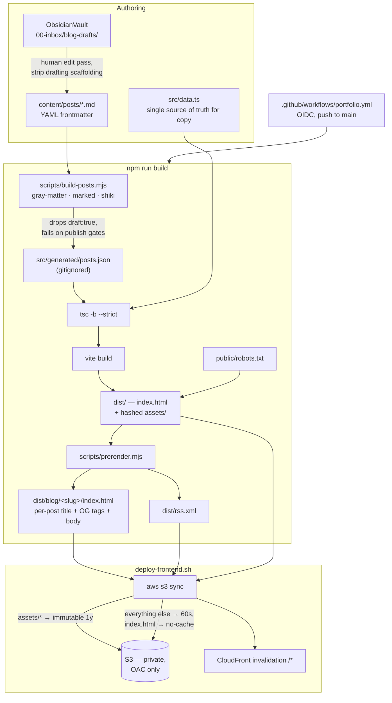
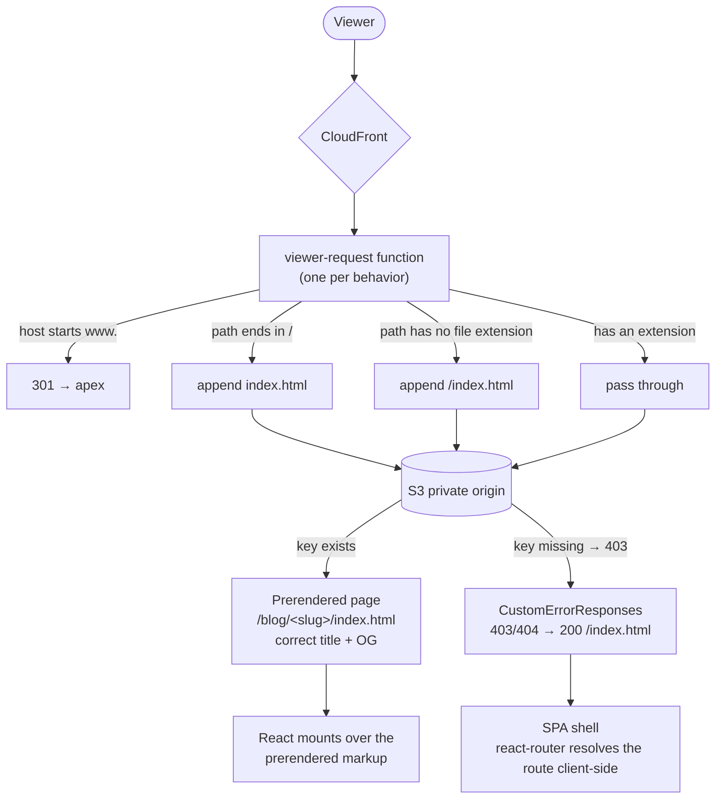

# Portfolio — austinjuliuskim.com

Personal portfolio + résumé site. Static React (Vite + TypeScript), served from
private S3 + CloudFront. Positions Austin for AI engineering roles (LLM/agent,
AI infra, full-stack AI).

## Structure

- `src/data.ts` — **single source of truth for all copy** (profile, about,
  projects, experience, skills). Edit this to update the site. Items marked
  `[confirm]` need a real figure before going live.
- `src/pages/Home.tsx` — one-page scrolling site (hero, about, work, skills, contact).
- `src/pages/Resume.tsx` + `resume.css` — `/resume` route, styled for screen and
  print. "Download PDF" = browser Print → Save as PDF (one page).
- `content/posts/*.md` — blog posts, markdown with YAML frontmatter. Rendered at
  build time; `draft: true` stages a post without publishing it.
- `src/pages/Blog.tsx` / `Post.tsx` + `blog.css` — `/blog` index and
  `/blog/:slug` post pages.
- `scripts/build-posts.mjs` / `prerender.mjs` — the build-time markdown pipeline
  and the per-page HTML/OG/RSS generator. See Architecture below.
- `deliverables/` — paste-ready career artifacts:
  - `resume.md` — plain-markdown résumé (mirror of the `/resume` page).
  - `linkedin-copy-pack.md` — headline, About, experience bullets, skills, Featured.
- `template.yaml` / `deploy-params.json` / `deploy-frontend.sh` — S3+CloudFront
  deploy, mirroring `apps/guided-repl`.

## Architecture

Two diagrams rather than three: there is no separate tech-stack diagram because
the stack is three runtime dependencies (`react`, `react-dom`,
`react-router-dom`) and everything else runs at build time — the build diagram
below *is* the stack.

### Build and publish

Markdown, frontmatter parsing and syntax highlighting all run in Node during the
build, so `marked` / `gray-matter` / `shiki` are devDependencies and never reach
the browser bundle.



### Request path

S3 is a REST origin, so it does not resolve directory indexes. The
viewer-request function supplies that, which is what lets a shared blog link
render its own title and preview card instead of the generic SPA shell.



Consequence worth knowing: because 403 and 404 both return 200 with the SPA
shell, **no URL on this site can return a real 404**. A typo'd post URL renders
the client-side 'not found' view, not an HTTP error.

## Develop

```
npm install
npm run dev      # http://localhost:5173
npm run build    # tsc -b && vite build → dist/
npm run preview  # serve the production build
```

## Deploy

**CI/CD:** pushes to `main` that touch `apps/portfolio/**` build and deploy
automatically via `.github/workflows/portfolio.yml` (OIDC role
`portfolio-github-deploy`, no stored AWS keys). PRs run the build only.

**One-time bootstrap** (admin AWS creds): `scripts/bootstrap-infra.sh` provisions
the ACM cert + DNS validation, the GitHub OIDC deploy role (trust +
`docs/iam-policy.json`), and the initial CloudFormation stack, then upserts the
apex Route53 alias. Idempotent — safe to re-run. `--dry-run` to preview.

**Manual deploy:** `npm run deploy` (runs `deploy-frontend.sh`: build → S3 sync →
CloudFront invalidation), reading stack outputs from `deploy-params.json`.

## Status

Live at `austinjuliuskim.com`, deployed by CI on push to `main`. Content is
filled in and NDA-reviewed; the blog is live at `/blog` with an RSS feed at
`/rss.xml`.

The distribution is on the CloudFront **Free pricing plan**, which has two
consequences: its WAF web ACL is attached out of band and must stay declared as
`WebAclArn` in `deploy-params.json` (removing it fails every distribution
update), and standard access logs are unavailable, so there is no server-side
traffic data.

## License

Split, deliberately:

- **Code is MIT** — components, styles, build config, CloudFormation template,
  deploy scripts. See [LICENSE](LICENSE). Reuse it freely.
- **Content is All Rights Reserved** — the copy in `src/data.ts`, the résumé at
  `/resume`, and everything under `deliverables/`. See [LICENSE-CONTENT](LICENSE-CONTENT).

Copying the code gets you an empty portfolio shell, not someone else's career history.
